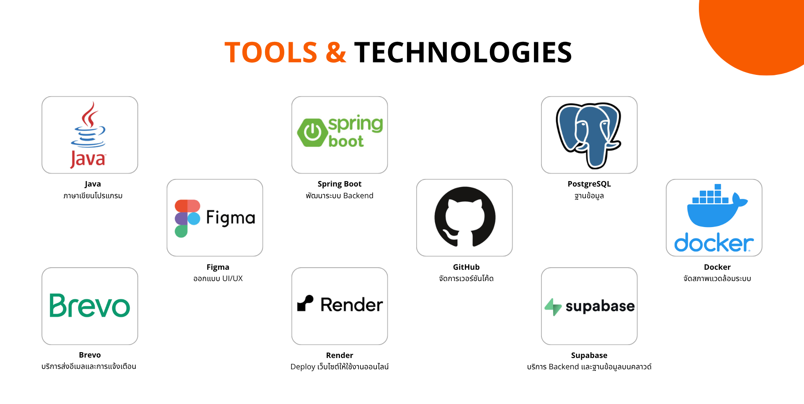
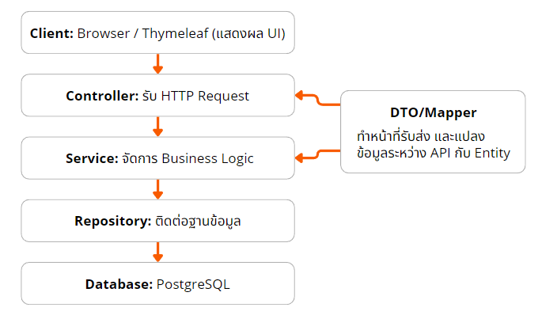
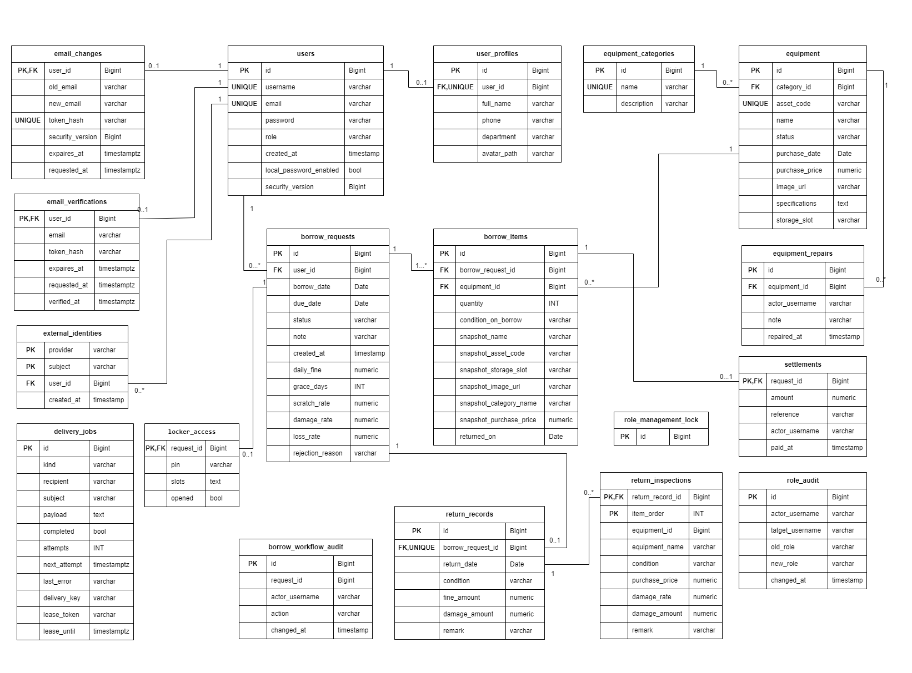

# LeadIT — ระบบยืม–คืนอุปกรณ์ไอที

LeadIT เป็นเว็บสำหรับจัดการอุปกรณ์และการยืม–คืนภายในองค์กร ผู้ใช้เลือกอุปกรณ์ ส่งคำขอ และติดตามสถานะได้จากหน้าเว็บ เจ้าหน้าที่ตรวจคำขอ อนุมัติ และบันทึกการคืน ส่วนผู้ดูแลจัดการอุปกรณ์ หมวดหมู่ และสิทธิ์ผู้ใช้ ระบบมีประวัติการยืมและสรุปค่าใช้จ่ายหลังคืนอุปกรณ์

โปรเจคนี้จัดทำสำหรับวิชา **CP353002 Principles of Software Design and Development** โดยใช้ Spring Boot และ Thymeleaf

## สมาชิกกลุ่ม

| ชื่อ–นามสกุล | รหัสนักศึกษา | Section | Branch | หน้าที่หลัก |
| --- | --- | --- | --- | --- |
| นางสาวกัญญาภัค ทองวิเศษ | 673380391-3 | 3 | `kanyaphak_673380391-3_03` | หน้าเว็บ การเชื่อมระบบ ไดอะแกรม เล่มรายงาน และรวบรวมสไลด์ |
| นางสาวอลิชา ชนะบุญ | 673380431-7 | 3 | `alicha_673380431-7_03` | ข้อมูลผู้ใช้และอุปกรณ์ DTO/Mapper หน้า error และเอกสาร Design Patterns |
| นายธนดล ไชยศิลา | 673380585-0 | 3 | `tanadon_673380585-0_03` | กระบวนการยืม–คืน สถานะ ค่าปรับ การทดสอบ ปรับ UI มือถือ และเอกสาร SOLID/Test Report |

ตารางนี้สรุปหน้าที่หลัก สมาชิกมีส่วนช่วยแก้ไขและตรวจงานร่วมกัน

## การใช้งานหลัก

ผู้ยืมเลือกอุปกรณ์และเพิ่มใน Borrowing list ก่อนส่งคำขอ เจ้าหน้าที่อนุมัติหรือปฏิเสธ เมื่ออนุมัติแล้วอุปกรณ์จะแสดง Reserved และกันไว้สำหรับคำขอนั้น ผู้ยืมกด Confirm pickup เพื่อเปลี่ยนเป็น In use หลังตรวจคืน ระบบบันทึกสภาพ ประวัติ และค่าใช้จ่ายที่เกี่ยวข้อง

ระบบรับอุปกรณ์ผ่าน PIN เป็นการจำลอง ไม่ได้เชื่อมตู้ฮาร์ดแวร์จริง

| Role | สิทธิ์หลัก |
| --- | --- |
| USER | ส่งคำขอยืม รับอุปกรณ์ และดูประวัติของตน |
| VIP | ใช้งานเหมือน USER แต่ใช้นโยบายค่าปรับ VIP |
| STAFF | จัดการคำขอ ตรวจคืน และเพิ่ม/แก้ข้อมูลอุปกรณ์ |
| ADMIN | ทำงานเจ้าหน้าที่ได้ รวมถึงจัดการ Role หมวดหมู่ และลบอุปกรณ์ |

เจ้าหน้าที่ต้องเป็นคนละบัญชีกับผู้ยืมในการดำเนินการที่ระบบกำหนด ค่าเริ่มต้นของค่าคืนล่าช้าคือ USER 50 บาท/วัน ไม่มีวันผ่อนผัน และ VIP 30 บาท/วัน ผ่อนผัน 2 วันหลังครบกำหนด ค่าเสียหายคิดแยกต่างหาก โดยค่าต่าง ๆ ปรับได้ผ่าน configuration

## Tech Stack



### เทคโนโลยีและหน้าที่ในระบบ

| ส่วน | เทคโนโลยี | ใช้ทำอะไรใน LeadIT |
| --- | --- | --- |
| ภาษา | **Java 17** | เขียนโค้ดฝั่งเซิร์ฟเวอร์ เช่น เงื่อนไขยืม–คืนและการคำนวณค่าปรับ |
| Backend | **Spring Boot 4.1.1** | ตั้งค่าและรันแอป เชื่อมส่วนต่าง ๆ ของระบบเข้าด้วยกัน |
| เว็บและ API | **Spring MVC** | รับ HTTP request ผ่าน Controller และส่งหน้าเว็บหรือข้อมูล JSON กลับ |
| ความปลอดภัย | **Spring Security** | จัดการ login, สิทธิ์ตาม Role, session และ CSRF |
| ตรวจข้อมูล | **Bean Validation** | ตรวจข้อมูลที่รับจากฟอร์มและ API เช่น ช่องที่ต้องกรอกและความยาวข้อความ |
| หน้าจอ | **Thymeleaf** | สร้าง HTML ฝั่งเซิร์ฟเวอร์โดยนำข้อมูลจาก Controller มาแสดง |
| ส่วนโต้ตอบ | **HTML, CSS และ JavaScript** | จัดหน้าเว็บ รองรับมือถือ และควบคุมเมนู ฟอร์ม และ modal |
| ฐานข้อมูล | **PostgreSQL** | เก็บผู้ใช้ อุปกรณ์ คำขอยืม การคืน และประวัติที่เกี่ยวข้อง |
| การเข้าถึงข้อมูล | **Spring Data JPA / Hibernate** | เชื่อม Entity กับตาราง และอ่านหรือบันทึกข้อมูลผ่าน Repository |
| โครงสร้างฐานข้อมูล | **Flyway** | จัดการการเปลี่ยน schema ตามลำดับ migration |
| บริการคลาวด์ | **Supabase** | โฮสต์ PostgreSQL และเก็บรูปอัปโหลดใน Supabase Storage |
| อีเมล | **Brevo** | ส่งอีเมลผ่าน HTTPS API ตามงานที่ระบบบันทึกเข้าคิว |
| เข้าสู่ระบบ | **Google OpenID Connect** | ยืนยันตัวตนผ่านบัญชี Google เมื่อเปิดใช้งานและตั้งค่าบริการแล้ว |
| เอกสาร API | **Swagger / OpenAPI** | แสดงรายละเอียด endpoint และทดลองเรียก API |
| Build | **Maven + Maven Wrapper** | จัดการ dependency รันทดสอบ และสร้างไฟล์ JAR |
| Unit/Integration tests | **JUnit 5, Mockito และ Spring Boot Test** | ตรวจเงื่อนไขธุรกิจ จำลอง dependency และทดสอบส่วนต่าง ๆ ร่วมกัน |
| ฐานข้อมูลทดสอบ | **H2 และ PostgreSQL** | ทดสอบกับฐานข้อมูลแยกจากข้อมูลใช้งานจริง |
| ตรวจ UI | **Playwright** | เปิดเบราว์เซอร์อัตโนมัติเพื่อตรวจหน้าจอและการโต้ตอบหลายขนาดจอ |
| สภาพแวดล้อม | **Docker / Docker Compose** | แพ็กแอปและเปิดแอปพร้อมฐานข้อมูลในเครื่อง |
| Hosting | **Render** | รันเว็บให้เข้าถึงได้ผ่าน URL สาธารณะ |
| CI/CD | **GitHub Actions** | Build/Test อัตโนมัติ และเรียก Deploy Hook หลัง tests ผ่านเมื่อ workflow ใหม่อยู่บน main และตั้ง secret ครบ |
| ออกแบบหน้าจอ | **Figma** | ใช้ออกแบบหน้าจอและ User Flow ก่อนพัฒนา |


## System Architecture

แยกงานเป็น Layered Architecture:



Controller รับคำขอและส่งผลกลับ Service ตรวจเงื่อนไขธุรกิจและจัดการ transaction ส่วน Repository ติดต่อฐานข้อมูล Entity แทนข้อมูลที่จัดเก็บ และ DTO/Mapper กำหนดข้อมูลที่รับส่งผ่าน API

Patterns หลักคือ State สำหรับสถานะคำขอยืม Strategy สำหรับนโยบายค่าปรับ และ Observer สำหรับเหตุการณ์แจ้งเตือน รายละเอียดอยู่ใน [Design Patterns](doc/design-patterns.md) และ [SOLID Analysis](doc/solid-analysis.md)

## Database Design



ความสัมพันธ์หลัก ได้แก่ User–UserProfile แบบ One-to-One, User–BorrowRequest และ BorrowRequest–BorrowItem แบบ One-to-Many รวมถึง EquipmentCategory–Equipment ส่วนคำขอยืมมี ReturnRecord ได้ไม่เกินหนึ่งรายการ

Flyway scripts อยู่ใน `code/src/main/resources/db/migration/` ระบบเก็บข้อมูลอุปกรณ์และนโยบายค่าปรับ ณ เวลายืม เพื่อให้ประวัติไม่เปลี่ยนตามข้อมูลที่แก้ภายหลัง รูปอัปโหลดเก็บใน Supabase Storage และฐานข้อมูลเก็บ path/URL อ้างอิง

## Installation & Setup

เตรียม JDK 17 และ PostgreSQL หรือใช้ Docker สำหรับรันแอปพร้อมฐานข้อมูล

```bash
git clone https://github.com/tanadoncha-bit/Project_POSD.git
cd Project_POSD
```

สร้างไฟล์ `.env` ที่โฟลเดอร์หลัก ไฟล์นี้ใช้เฉพาะในเครื่องและไม่เก็บใน Git ตัวอย่างค่าขั้นต่ำสำหรับฐานข้อมูลใหม่:

```properties
DB_URL=jdbc:postgresql://localhost:5432/leadit
DB_USERNAME=your_database_user
DB_PASSWORD=your_database_password
APP_PROFILE=migrations
APP_JOBS_ENABLED=false
```

สร้างฐานข้อมูลก่อนรัน โปรไฟล์ `migrations` เปิด Flyway สำหรับจัดโครงสร้างฐานข้อมูล หากใช้ฐานข้อมูลเดิม ต้องตรวจ migration history และข้อมูลก่อนเปิดโปรไฟล์นี้

ความสามารถเสริมตั้งค่าตามบริการที่ใช้:

| ความสามารถ | ค่าที่เกี่ยวข้อง |
| --- | --- |
| อัปโหลดรูป | `SUPABASE_URL`, `SUPABASE_SERVICE_ROLE_KEY`, `SUPABASE_AVATAR_BUCKET` |
| ส่งอีเมลผ่าน Brevo | `MAIL_PROVIDER=brevo`, `BREVO_API_KEY`, `MAIL_FROM`, `APP_JOBS_ENABLED=true` |
| ลิงก์ในอีเมล | `APP_BASE_URL` |
| เข้าระบบด้วย Google | `GOOGLE_LOGIN_ENABLED=true`, `GOOGLE_CLIENT_ID`, `GOOGLE_CLIENT_SECRET` |

กำหนด bucket และผู้ส่งอีเมลให้พร้อมก่อนเปิดบริการ เก็บ service key และ client secret ไว้ฝั่งเซิร์ฟเวอร์เท่านั้น ดูค่าที่ระบบรองรับใน `application.properties`

## How to Run

Windows:

```powershell
./mvnw.cmd spring-boot:run
```

Linux/macOS:

```bash
./mvnw spring-boot:run
```

เปิดเว็บที่ http://localhost:8080 หากแก้โค้ด Java ให้รีสตาร์ตแอปเพื่อโหลดเวอร์ชันใหม่

### รันด้วย Docker Compose

ตั้ง `LOCAL_DB_PASSWORD` ใน `.env` แล้วรัน:

```bash
docker compose up --build
```

Compose เปิดแอปที่พอร์ต 8080 พร้อม PostgreSQL 17 และเก็บข้อมูลใน volume โดยปิดงานส่งอีเมลเบื้องหลังไว้ตาม configuration ปัจจุบัน หยุดบริการด้วย `docker compose down`

## API Documentation

- Swagger UI: http://localhost:8080/swagger-ui.html
- OpenAPI: http://localhost:8080/v3/api-docs

API อยู่ใต้ `/api/v1/` ครอบคลุมอุปกรณ์ หมวดหมู่ ผู้ใช้ คำขอยืม การรับ–คืน และการชำระค่าใช้จ่าย Endpoint ที่แก้ข้อมูลต้องมีสิทธิ์ตามบทบาทและ CSRF token

## How to Run Tests

```powershell
./mvnw.cmd test
```

บน Linux/macOS ใช้ `./mvnw test` หากต้องการตรวจและสร้าง JAR ใช้ `verify`

ชุดทดสอบ PostgreSQL ต้องตั้ง `TEST_POSTGRES_URL`, `TEST_POSTGRES_USERNAME` และ `TEST_POSTGRES_PASSWORD` ให้ชี้ฐานข้อมูลทดสอบที่ล้างข้อมูลได้ ห้ามใช้ฐานข้อมูลจริง หากไม่ตั้งค่า บางชุดอาจถูกข้าม

ผล Maven อยู่ใน `target/surefire-reports/` อ่านผลและขอบเขตที่ตรวจได้ใน [Test Report](doc/test-report.md)

สคริปต์ UI อยู่ใน `test/tools/` ใช้ Playwright และรันแยกจาก Maven ส่วน GitHub Actions ใน `.github/workflows/build.yml` ตรวจ build/tests พร้อม PostgreSQL ไม่ใช่ workflow deploy อัตโนมัติ

## CI/CD

GitHub Actions รัน Build/Test เมื่อ push หรือเปิด PR และเรียก Render Deploy Hook เฉพาะ push เข้า main หลัง job verify ผ่าน โดยระบุ commit SHA ที่ทดสอบไว้ การตอบรับ hook หมายถึงเริ่มหรือเข้าคิว deploy ยังต้องตรวจสถานะ Live ใน Render

ตั้งค่าครั้งแรก:
1. ใน Render Settings คัดลอก Deploy Hook และตั้ง Branch เป็น main
2. ตั้ง Auto-Deploy เป็น Off เพื่อไม่ให้ deploy ข้ามผลทดสอบ
3. ใน GitHub Settings → Secrets and variables → Actions เพิ่ม secret ชื่อ RENDER_DEPLOY_HOOK_URL
4. Merge งานผ่าน PR เข้า main แล้วตรวจ workflow และผล deploy

render.yaml ระบุ main และปิด Auto Deploy ไว้ แต่ถ้าบริการไม่ได้จัดการผ่าน Blueprint ต้องตั้งใน Dashboard เอง ห้ามบันทึก Deploy Hook URL ลงไฟล์หรือเผยแพร่ใน log

## Deployment URL

https://leadit-4img.onrender.com/

ใช้ Dockerfile สำหรับ build และรันแอปบน Render ตั้งค่าฐานข้อมูลและบริการภายนอกผ่าน Environment ของบริการโฮสต์ รวมถึงโปรไฟล์ที่ต้องการใช้ หลัง deploy ควรตรวจรูป การล็อกอิน อีเมล และขั้นตอนยืม–คืนอีกครั้ง

## Project Structure

```text
code/src/main/
├── java/com/example/itborrow/
│   ├── config/
│   ├── controller/api/ และ controller/web/
│   ├── service/
│   ├── repository/
│   ├── domain/
│   ├── dto/
│   ├── mapper/
│   ├── exception/
│   ├── security/
│   └── common/
└── resources/
    ├── templates/
    ├── static/
    └── db/migration/
test/
├── src/test/
└── tools/
doc/
├── diagrams/
└── slide/
img/
.github/workflows/
.mvn/wrapper/
Dockerfile
docker-compose.yml
pom.xml
mvnw และ mvnw.cmd
```

ไฟล์ `.env`, logs, build output และข้อมูลสำรองฐานข้อมูลใช้เฉพาะในเครื่อง ไม่ควรนำขึ้น repository
