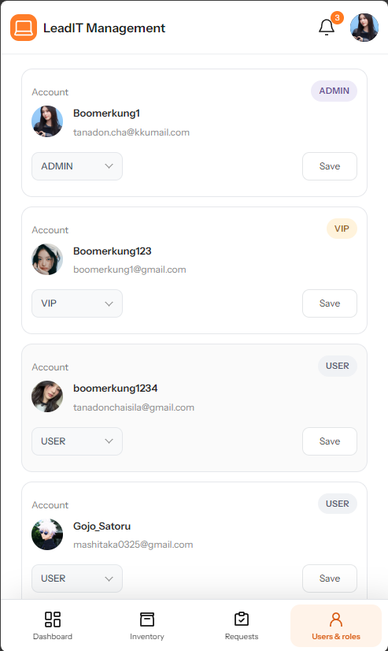
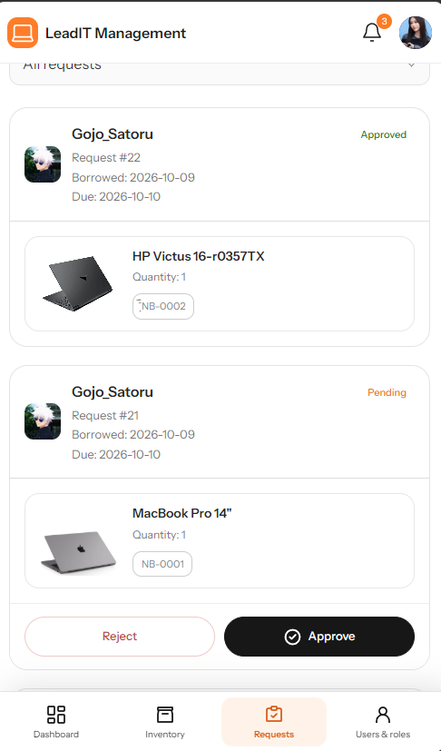
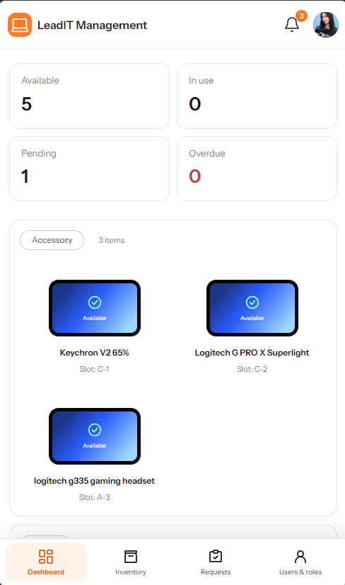
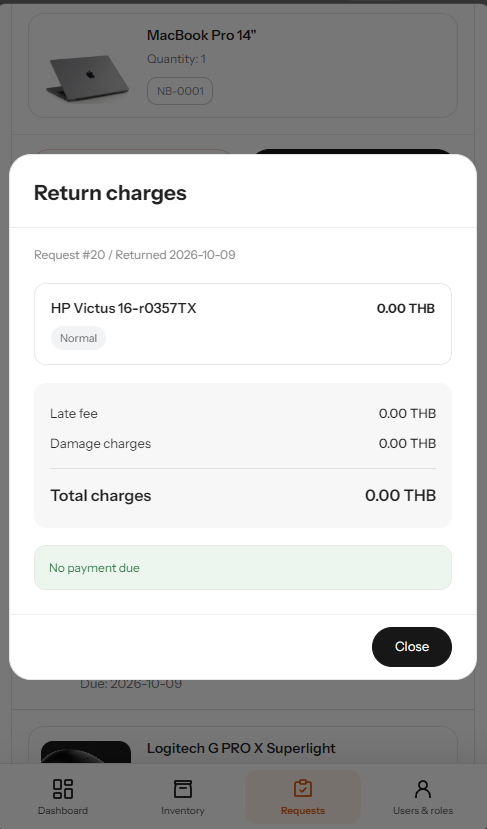

# รายงานการทดสอบระบบ LeadIT

วันที่จัดทำ: 9 ตุลาคม 2026

รายงานนี้รวบรวมผลทดสอบระบบยืม–คืนอุปกรณ์ ทั้งการทดสอบด้วยโค้ด การตรวจหน้าจอ และการทดลองใช้ผ่านหน้าเว็บ โดยตรวจขั้นตอนยืม–คืน สิทธิ์ผู้ใช้ การเปลี่ยนสถานะ ค่าปรับ และการใช้งานบนมือถือ

## สภาพแวดล้อม

ทดสอบบน Windows ด้วย Java 17 และ Spring Boot 4.1.1 ใช้ H2 และ PostgreSQL 18 โดยแยกฐานข้อมูลทดสอบจากฐานข้อมูลจริง บริการอีเมลและจัดเก็บรูปใช้ข้อมูลจำลองในชุดทดสอบที่เกี่ยวข้อง

โค้ดรวมงานจาก develop commit `63ee96d` แล้ว ส่วนการปรับ UI และ Mapper ในเครื่องยังไม่ได้ commit และ push

## ผลทดสอบอัตโนมัติ

ผลที่รวบรวมได้มี **221 กรณี จาก 19 ชุดทดสอบ** ไม่มีกรณีไม่ผ่าน ข้อผิดพลาด หรือกรณีที่ข้ามการทดสอบ รอบชุดเต็มผ่าน 220 กรณี ก่อนเพิ่มกรณีตรวจสถานะ null และทดสอบชุด Error Handling ซ้ำจนได้ผลรวม 221 กรณี สามารถสร้างไฟล์ JAR ได้สำเร็จ

| ชุดทดสอบ | จำนวน | ไม่ผ่าน | ข้อผิดพลาด | ข้าม |
|---|---:|---:|---:|---:|
| com.example.itborrow.BorrowStateTest | 34 | 0 | 0 | 0 |
| com.example.itborrow.ErrorHandlingRegressionTest | 13 | 0 | 0 | 0 |
| com.example.itborrow.GoogleOAuthIntegrationTest | 4 | 0 | 0 | 0 |
| com.example.itborrow.PostgresMigrationTest | 1 | 0 | 0 | 0 |
| com.example.itborrow.PostgresWorkflowIntegrationTest | 63 | 0 | 0 | 0 |
| com.example.itborrow.SecurityAndTimeTest | 5 | 0 | 0 | 0 |
| com.example.itborrow.service.AccountLoginSetupTest | 3 | 0 | 0 | 0 |
| com.example.itborrow.service.AvatarServiceTest | 2 | 0 | 0 | 0 |
| com.example.itborrow.service.BorrowRequestServiceTest | 9 | 0 | 0 | 0 |
| com.example.itborrow.service.DeliveryJobProcessorTest | 3 | 0 | 0 | 0 |
| com.example.itborrow.service.EquipmentHistoryImageTest | 1 | 0 | 0 | 0 |
| com.example.itborrow.service.EquipmentImageProcessorTest | 1 | 0 | 0 | 0 |
| com.example.itborrow.service.FeePolicyConfigurationTest | 3 | 0 | 0 | 0 |
| com.example.itborrow.service.GoogleAccountServiceTest | 6 | 0 | 0 | 0 |
| com.example.itborrow.service.jobs.BrevoEmailClientTest | 3 | 0 | 0 | 0 |
| com.example.itborrow.service.jobs.EmailDeliveryHandlerTest | 1 | 0 | 0 | 0 |
| com.example.itborrow.service.ReturnRecordServiceTest | 4 | 0 | 0 | 0 |
| com.example.itborrow.service.SupabaseImageStorageTest | 2 | 0 | 0 | 0 |
| com.example.itborrow.WorkflowIntegrationTest | 63 | 0 | 0 | 0 |

ชุดทดสอบตรวจทั้งการทำงานปกติและกรณีผิดเงื่อนไข เช่น เปลี่ยนสถานะไม่ได้ ผู้ใช้ไม่มีสิทธิ์ อุปกรณ์ไม่พร้อมให้ยืม และการย้อนกลับข้อมูลเมื่อธุรกรรมล้มเหลว รวมถึงค่าปรับ ข้อมูลอุปกรณ์ ณ เวลายืม การตรวจไฟล์รูป และการส่งงานซ้ำเมื่อบริการภายนอกมีปัญหา

หลังรวม develop และแก้ UI ล่าสุด ได้รัน BorrowStateTest, ErrorHandlingRegressionTest และ BorrowRequestServiceTest ซ้ำ **56 กรณี ผ่านทั้งหมด** เป็นการตรวจเฉพาะสามชุด ไม่ใช่การรันชุดเต็ม 221 กรณีใหม่

## ผลตรวจหน้าจอ

ตรวจด้วย Chromium บน localhost ที่ความกว้าง 360, 390, 500 และ 1280 พิกเซล ครอบคลุม Dashboard, Inventory, Borrow requests, User management และ My Requests

| รายการที่ตรวจ | ผล |
| --- | --- |
| เนื้อหาล้นแนวนอนในหน้าที่ตรวจ | ไม่พบ |
| เลื่อนหน้าหลังซ่อน scrollbar | เลื่อนได้ |
| หน้าสรุปค่าใช้จ่ายหลังคืนอุปกรณ์ที่มีหลายรายการ | เลื่อนถึงปุ่มปิดได้ และเลื่อนหน้าหลักต่อได้หลังปิด |
| API รับ ID ผิดรูปแบบ | ตอบ 400 |
| API เรียกด้วย method ที่ไม่รองรับ | ตอบ 405 พร้อม Allow |
| JavaScript error ระหว่างทดสอบ | ไม่พบ |

หน้าสรุปค่าใช้จ่ายหลังคืนอุปกรณ์ใช้ข้อมูลจำลอง 8 รายการเพื่อทดสอบหน้าจอ ไม่ได้ใช้ยืนยันยอดค่าปรับจริง

ภาพจากรอบทดสอบ:









| รายการ | ขนาดหน้าจอ | ผล |
| --- | --- | --- |
| Dropdown: เลือกสถานะ อัปเดตค่าที่แสดง และ Escape | 360, 390, 500, 1280px | ผ่าน |
| เมนูด้านล่างและความกว้างหน้าจัดการ | 320–1280px | ผ่าน |
| Borrowing list ใน navbar ของ Home, Equipment และ My Requests | 320–1280px | ผ่าน |

การตรวจเพิ่มเติมใช้ HTML ตัวอย่างร่วมกับ CSS และ JavaScript ของโปรเจค จึงตรวจได้เฉพาะพฤติกรรมที่ระบุ ไม่ครอบคลุมการเชื่อม API ทุกขั้นตอน สคริปต์ตรวจ dropdown อยู่ที่ `test/tools/mobile-picker.cjs`

## ผลทดลองใช้ผ่านหน้าเว็บ

ผู้ทดสอบแจ้งว่าได้ลองขั้นตอนต่อไปนี้แล้วและผ่านทั้งหมด เมื่อวันที่ 9 ตุลาคม 2026

| ขั้นตอน | ผล |
| --- | --- |
| เลือกอุปกรณ์ เพิ่ม Borrowing list และส่งคำขอ | ผ่าน |
| STAFF อนุมัติคำขอ | ผ่าน |
| USER ตรวจ PIN และยืนยันรับอุปกรณ์ | ผ่าน |
| STAFF บันทึกคืนและสภาพอุปกรณ์ | ผ่าน |
| ตรวจ Returned ประวัติ ค่าปรับ และความพร้อมอุปกรณ์ | ผ่าน |
| USER ยกเลิกคำขอ | ผ่าน |
| STAFF ปฏิเสธคำขอ | ผ่าน |

ผลส่วนนี้มาจากการยืนยันของผู้ทดสอบ ยังไม่มีรายละเอียดเบราว์เซอร์ เวอร์ชันโค้ด และภาพรายกรณี ผู้ทดสอบยืนยันเพิ่มเติมว่ารูปใน Needs attention บน localhost แสดงได้แล้วหลังรีสตาร์ตแอป

## วิธีรันทดสอบซ้ำ

เตรียม PostgreSQL สำหรับทดสอบโดยเฉพาะ แล้วรันจากโฟลเดอร์หลัก

```powershell
$env:TEST_POSTGRES_URL='jdbc:postgresql://127.0.0.1:55439/leadit_test'
$env:TEST_POSTGRES_USERNAME='review_test'
$env:TEST_POSTGRES_PASSWORD='your-test-database-password'
./mvnw.cmd '-Dapp.mail.provider=smtp' '-Dapp.mail.brevo-api-key=' '-Dapp.public-base-url=http://localhost:8080' clean verify
```

ฐานข้อมูลต้องล้างข้อมูลได้ เพราะชุดทดสอบ workflow สร้างตารางใหม่ ห้ามใช้ production หากไม่ได้ตั้งค่า PostgreSQL บางชุดอาจถูกข้าม ต้องตรวจจำนวน skipped ด้วย รายงานจาก Maven อยู่ใน `target/surefire-reports/`

## ผลตรวจ UI กับแอปล่าสุด

หลังปรับสคริปต์ให้ตรงกับหน้าจอปัจจุบัน ได้รัน mobile-admin.cjs, mobile-layout.cjs และ ui-smoke.cjs กับแอป localhost:8089 โดยใช้ฐานข้อมูลทดสอบแยก ผ่านทุกชุด ไม่พบ JavaScript page error ในกรณีที่ตรวจ

- ตรวจหน้าจัดการ ผู้ใช้ คำขอ Inventory, Dashboard และ My Requests ที่ 360, 390, 500 และ 1280px
- เลือก Pending ผ่าน dropdown, เปิด Bell เป็นหน้า Needs attention และกดกลับได้
- แตะชื่อในรายการ Inventory แล้วเปิดรายละเอียดและปิดได้
- ตรวจฟอร์มสมัคร รายละเอียดอุปกรณ์ ฟอร์มยืม โปรไฟล์ และหน้าต่างที่ความสูงจอลดลง
- ตรวจหน้าต่างสรุปค่าใช้จ่ายด้วยข้อมูลจำลอง รวมการเลื่อนและคืนการเลื่อนพื้นหลัง

ผลนี้มาจากแอปที่รันจริงในเครื่องกับฐานข้อมูลทดสอบ ไม่ใช่ผล deployment หรือคีย์บอร์ดบนมือถือจริง รูปหลักฐานเดิมในรายงานยังเป็นรูปจากรอบก่อน ภาพรอบใหม่นี้อยู่ใน tmp/mobile-fix-results/, tmp/mobile-results/ และ tmp/ui-results/
